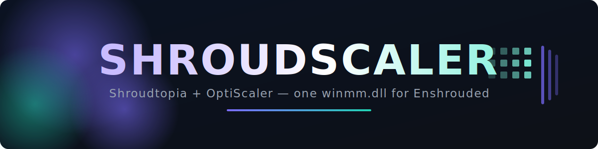
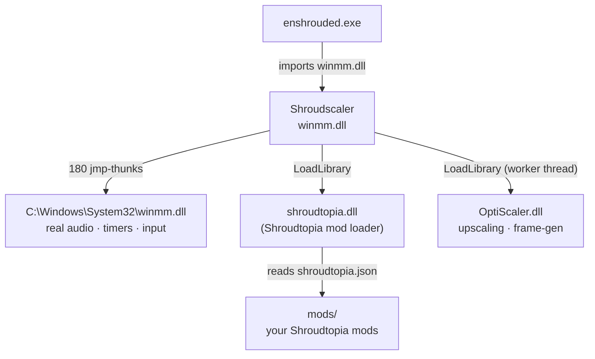

<div align="center">



<h3>One <code>winmm.dll</code> that runs <a href="https://github.com/s0t7x/shroudtopia">Shroudtopia</a> <b>and</b> <a href="https://github.com/optiscaler/OptiScaler">OptiScaler</a> together in <a href="https://enshrouded.com">Enshrouded</a>.</h3>

<!-- Replace OWNER/REPO with your GitHub path -->
[](https://github.com/OWNER/REPO/actions/workflows/build.yml)
[](https://github.com/OWNER/REPO/releases)
[](https://github.com/OWNER/REPO/releases)
[](LICENSE)


**[What &amp; why](#-what-is-this)** ·
**[Features](#-features)** ·
**[How it works](#-how-it-works)** ·
**[Install](#-installation)** ·
**[Build](#%EF%B8%8F-building)** ·
**[Under the hood](#-under-the-hood)** ·
**[FAQ](#-troubleshooting)** ·
**[Credits](#-credits)**

</div>

---

## 🌫️ What is this?

Both **Shroudtopia** and **OptiScaler** install themselves as `winmm.dll` next to
`enshrouded.exe` — and only one `winmm.dll` can live there. So out of the box you can
run the mod loader **or** the upscaler, never both.

**Shroudscaler** is a tiny proxy DLL that claims that slot and loads **both** of them.
Drop it in, keep Shroudtopia and OptiScaler exactly as they are, and they coexist.

> [!NOTE]
> Nothing is patched, cracked, or injected into the game. Shroudscaler only **forwards
> the real winmm API** and **calls `LoadLibrary`** on the two mods. It's a loader — the
> kind of thing every "two proxy mods at once" setup needs.

> [!WARNING]
> **Build it yourself or use the CI artifact.** A `winmm.dll` next to the game runs with
> full game privileges — never trust one from a stranger. The whole point of this repo
> is that the source is right here and GitHub Actions compiles it on every push.

## ✨ Features

- 🧩 **Runs both mods from one slot** — Shroudtopia *and* OptiScaler, no conflict.
- 🔊 **Zero side effects** — all 180 winmm functions are forwarded to the genuine
  `System32\winmm.dll`, so audio, multimedia timers and joystick input are untouched.
- 🪶 **Tiny & transparent** — ~24 KB, no dependencies, every line is in this repo.
- 🛠️ **Two clean builds** — free MinGW-w64 (used by CI) **or** Visual Studio.
- 🤖 **CI-built** — push a tag and a ready `winmm.dll` is attached to the Release.
- 📦 **Drop-in** — replace one file, leave `shroudtopia.dll`, `shroudtopia.json` and your
  `mods/` folder alone.

## 🧠 How it works



When Enshrouded loads `winmm.dll`, Shroudscaler does three things:

1. **Forwards the real winmm API.** Every export is a thin `jmp` that lands in the
   genuine system `winmm.dll`, resolved at load. The game can't tell the difference.
2. **Loads Shroudtopia** via `LoadLibrary("shroudtopia.dll")` — the same call
   Shroudtopia's own proxy makes — so it and your `mods/` folder come up normally.
3. **Loads OptiScaler** via `LoadLibrary("OptiScaler.dll")` on a worker thread.

> You can't literally fuse two compiled DLLs into one file — each has its own code,
> exports and entry point. A loader like this is the correct way to "combine" two proxy
> mods, which is why you end up with one `winmm.dll` plus the two mods beside it.

## 📦 Installation

**You need the two mods first** (not included here — get them from the source):

| Mod | By | Get it |
|-----|----|--------|
| 🌀 **Shroudtopia** | s0t7x | [GitHub](https://github.com/s0t7x/shroudtopia) · [Nexus](https://www.nexusmods.com/enshrouded/mods/43) |
| 🔭 **OptiScaler** | nitec (cdozdil) | [GitHub](https://github.com/optiscaler/OptiScaler) |

Then, in your Enshrouded game folder (next to `enshrouded.exe`):

1. Install **Shroudtopia** normally (gives you `winmm.dll`, `shroudtopia.dll`,
   `shroudtopia.json`, `mods/`).
2. **Replace** Shroudtopia's `winmm.dll` with Shroudscaler's `winmm.dll`
   ([latest Release](https://github.com/OWNER/REPO/releases)).
3. Add **OptiScaler** (`OptiScaler.dll` + `OptiScaler.ini`) to the same folder.

Leave `shroudtopia.dll`, `shroudtopia.json` and `mods/` untouched — Shroudscaler loads
them by name.

```text
Enshrouded/
├─ enshrouded.exe
├─ winmm.dll          ← Shroudscaler  (replaces Shroudtopia's winmm.dll)
├─ shroudtopia.dll    ← Shroudtopia   (unchanged)
├─ shroudtopia.json   ← Shroudtopia config (unchanged)
├─ mods/              ← your Shroudtopia mods (unchanged)
├─ OptiScaler.dll     ← OptiScaler
└─ OptiScaler.ini     ← OptiScaler config
```

## 🛠️ Building

<details>
<summary><b>GitHub Actions (recommended — zero setup)</b></summary>

Every push builds `winmm.dll` and uploads it as a workflow **artifact**. Push a `v*`
tag and it's also attached to a **Release** automatically. See
[`.github/workflows/build.yml`](.github/workflows/build.yml).
</details>

<details>
<summary><b>MinGW-w64 (Linux or MSYS2 — free)</b></summary>

```bash
# Debian/Ubuntu: sudo apt-get install gcc-mingw-w64-x86-64
cd src
x86_64-w64-mingw32-g++ -O2 -s -shared -static -static-libgcc -static-libstdc++ \
    -o winmm.dll thunks.S main.cpp winmm.def -lkernel32
```
</details>

<details>
<summary><b>Visual Studio</b></summary>

Open [`msvc/winmm.sln`](msvc/winmm.sln) and build **Release | x64**. Requires the
*Desktop development with C++* workload.
</details>

## 🔩 Under the hood

The interesting part of any winmm proxy: it must re-export **every** winmm function and
forward it to the real DLL **without referring to itself**. Two toolchains, two ways —
and the repo ships both:

**Visual Studio** ([`msvc/dllmain.cpp`](msvc/dllmain.cpp)) — each forwarder is a linker
directive, exactly like Shroudtopia's original proxy:

```cpp
#pragma comment(linker, "/export:timeGetTime=c:\\windows\\system32\\winmm.timeGetTime,@141")
```

**MinGW / CI** ([`src/`](src)) — GNU `ld` can't put an absolute path in a `.def`
forwarder, so every export is a real **jump thunk** ([`thunks.S`](src/thunks.S)):

```asm
.globl timeGetTime
timeGetTime:
    jmp *g_ptrs+1104(%rip)     ; -> real winmm.timeGetTime
```

At load, [`main.cpp`](src/main.cpp) `LoadLibrary`s the genuine system `winmm.dll` and
fills `g_ptrs[]` via `GetProcAddress`. On x86-64 a bare `jmp` preserves every register
and the stack, so it works for any function signature regardless of arguments. Both
variants produce a functionally identical DLL.

```text
src/         portable build (GCC/MinGW)        ← built by CI
  main.cpp     load logic + thunk pointer table
  thunks.S     180 jmp-thunks, one per export
  winmm.def    export table (name + ordinal)
msvc/        Visual Studio variant (pragma forwarders, equivalent output)
assets/      banner
.github/     CI build
```

## ❓ Troubleshooting

<details>
<summary><b>OptiScaler overlay (Insert) doesn't show up</b></summary>

Some OptiScaler builds want a graphics-proxy filename. Rename `OptiScaler.dll` to
`dxgi.dll` (Enshrouded is DX12) — it then loads directly, and Shroudscaler still handles
Shroudtopia. `version.dll` works too.
</details>

<details>
<summary><b>Game won't start / instant crash</b></summary>

Make sure you replaced **only** `winmm.dll` and that `shroudtopia.dll` is still present
and unrenamed. Then verify your game files via Steam to rule out an unrelated issue.
</details>

<details>
<summary><b>No sound after installing</b></summary>

That shouldn't happen — winmm is fully forwarded. If it does, your antivirus may have
quarantined the DLL, or a stale `winmm.dll` from another tool is being used. Rebuild
from source / grab a fresh CI artifact.
</details>

## 🙏 Credits

- 🌀 **[Shroudtopia](https://github.com/s0t7x/shroudtopia)** — © **s0t7x**, MIT. The
  *proxy-loads-`shroudtopia.dll`* technique comes straight from its source.
- 🔭 **[OptiScaler](https://github.com/optiscaler/OptiScaler)** — © **nitec (cdozdil)**
  and contributors.

Shroudscaler is only the small loader that brings the two together.

## ⚖️ License & disclaimer

Shroudscaler's loader code is released under the **[MIT License](LICENSE)**. Shroudtopia
and OptiScaler are **not** included and keep their own licenses.

Provided as-is, no warranty. Intended for single-player / co-op. Game mods can break with
updates — if something misbehaves, remove the DLLs and verify your game files.

---

## 🇩🇪 Deutsch

Eine einzige `winmm.dll`, die **Shroudtopia** und **OptiScaler** gleichzeitig in
**Enshrouded** lädt. Beide installieren sich normalerweise als `winmm.dll` und blockieren
sich gegenseitig — es kann nur eine geben. **Shroudscaler** belegt diesen Platz und lädt
**beide**. Nichts wird gepatcht oder gecrackt, es ist nur ein Loader.

> [!WARNING]
> Selbst bauen oder das CI-Artefakt nehmen. Eine `winmm.dll` neben dem Spiel läuft mit
> allen Rechten des Spiels — führe niemals eine von Fremden aus. Der Sinn des Repos ist,
> dass der Quellcode offen liegt und CI ihn bei jedem Push baut.

**Was es macht:** Beim Laden leitet Shroudscaler alle 180 winmm-Funktionen per
`jmp`-Thunk ans echte `System32\winmm.dll` weiter (Sound, Timer, Joystick bleiben
unberührt), lädt `shroudtopia.dll` (genau wie Shroudtopias eigene `winmm.dll`) und
zusätzlich `OptiScaler.dll`.

**Installation:** Shroudtopia normal installieren → dessen `winmm.dll` durch die von
Shroudscaler **ersetzen** → `OptiScaler.dll` + `OptiScaler.ini` dazulegen.
`shroudtopia.dll`, `shroudtopia.json` und `mods/` bleiben unverändert.

**Bauen:** `cd src && x86_64-w64-mingw32-g++ -O2 -s -shared -static -static-libgcc -static-libstdc++ -o winmm.dll thunks.S main.cpp winmm.def -lkernel32` — oder `msvc/winmm.sln` in Visual Studio (`Release | x64`).

**Geht das OptiScaler-Overlay (Einfg) nicht auf?** `OptiScaler.dll` in `dxgi.dll`
umbenennen (Enshrouded = DX12).

**Credits:** Shroudtopia © s0t7x (MIT), OptiScaler © nitec (cdozdil). Beide **nicht**
enthalten, eigene Lizenzen. Loader-Code unter MIT. Ohne Gewähr; für Singleplayer / Koop.
